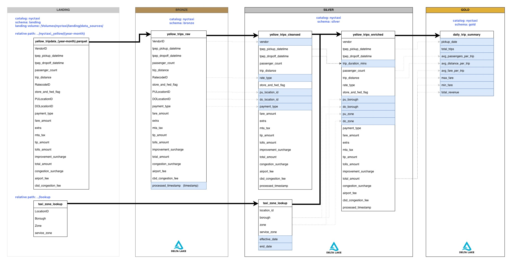

# NYC Taxi Data Engineering Pipeline on Databricks

## Project Overview

This project demonstrates an end to end Data Engineering solution built on Databricks using the Medallion Architecture. The pipeline ingests raw NYC Taxi trip data into a Landing zone before progressively transforming it through Bronze, Silver, and Gold layers using Apache Spark and Delta Lake.

The project focuses on building production style data pipelines that implement data cleansing, enrichment, dimensional modelling, and analytical aggregations while following modern lakehouse best practices.

---

## Architecture

Landing
→ Bronze
→ Silver
→ Gold

- **Landing**
  - Raw NYC Taxi parquet files
  - Taxi Zone lookup dataset
  - Immutable source files

- **Bronze**
  - Raw ingestion into Delta tables
  - Schema enforcement
  - Audit columns
  - Minimal transformations

- **Silver**
  - Data cleansing
  - Standardised column names
  - Data quality validation
  - Trip duration calculation
  - Lookup enrichment using Taxi Zone dimension
  - Business ready datasets

- **Gold**
  - Daily trip summary
  - Revenue metrics
  - Trip statistics
  - Business reporting tables

---

## Technologies

- Databricks
- Apache Spark
- Delta Lake
- PySpark
- SQL
- Unity Catalog
- Delta Tables
- GitHub